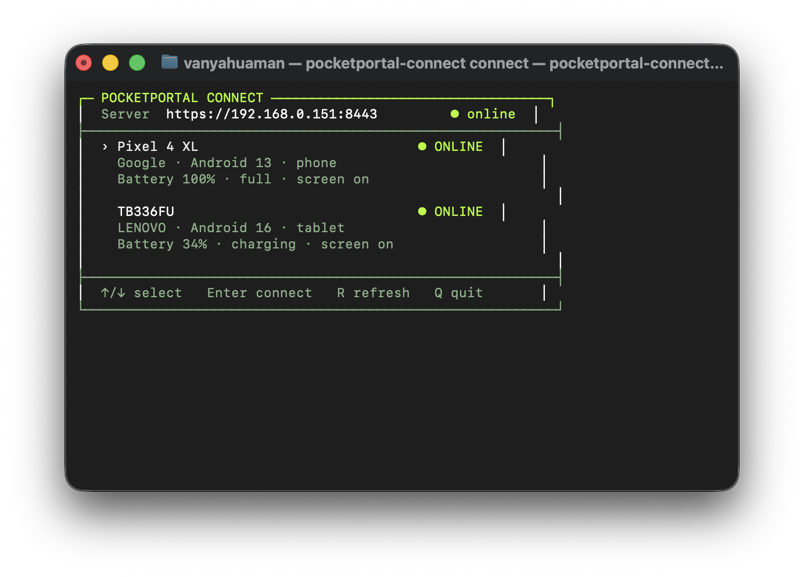

# Terminal interface

The interactive launcher shows every online Android device returned by the
PocketPortal inventory API.

<div class="pp-product-shot" markdown>



<p class="pp-caption">Interactive device picker with arrow-key navigation and live device status.</p>

</div>

## Controls

| Key | Action |
| --- | --- |
| `↑` / `↓` | Change the selected device |
| `Enter` | Open the selected device bridge |
| `R` | Refresh live inventory |
| `Q` | Quit without connecting |
| `Ctrl+C` | Disconnect an active session |

## Direct selection

A readable normalized model name can bypass the picker:

```bash
pocketportal-connect connect --device pixel-4-xl
```

The hardware serial remains the internal stable identifier. Advanced users can
still pass it explicitly with `--serial`.
